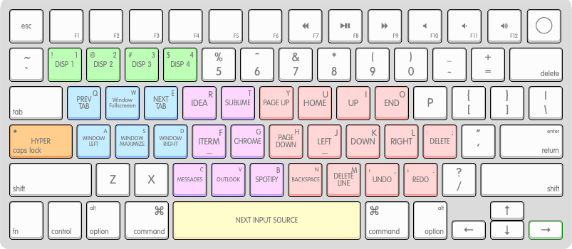
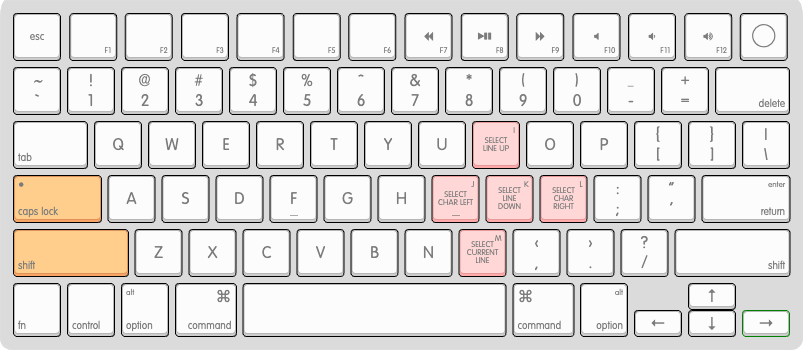
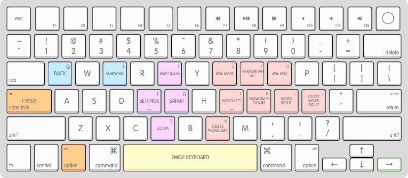
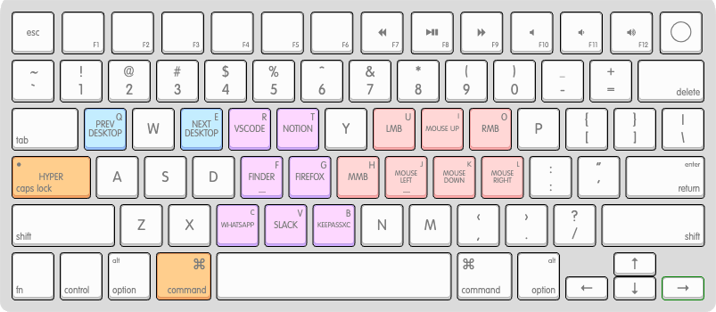
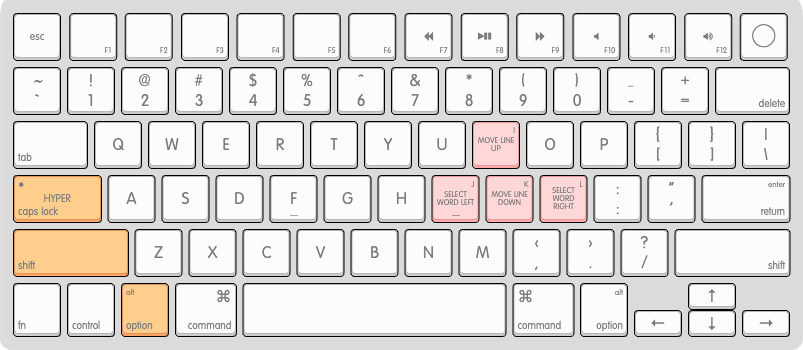
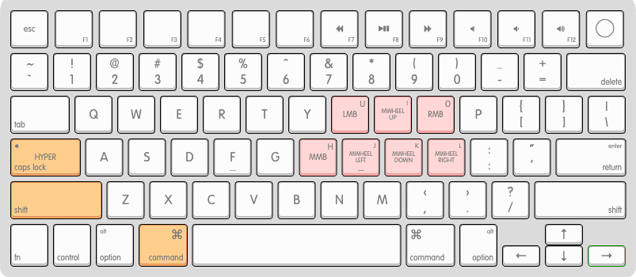

# HyperIJKL

Yet another one productivity-oriented keyboard keys remapper for macOS.  
It is largely based on [Vonng's](https://github.com/Vonng) [CapsLock Enhancement](https://github.com/Vonng/Capslock), but with a twist:
WASD-style navigation instead of Vim-style.  
For those who are more accustomed to arrow keys or FPS controls.

This set up is tailored specifically to my workflow and has no aim to cover all possible use cases, though it is easily customizable to your preferences if you like the general idea.

## Overview

Turn `Capslock` into a new modifier – **Hyper** `*` (simulates the simultaneous press of `right_shift` + `right_control` + `right_option` + `right_command`).
Do stuff without moving your hands away from the keyboard's home row:

- Navigate and edit text quickly

- Delete words and lines with a single key press

- Navigate macOS: desktops, apps and tabs

- Start and switch active apps

- Control the mouse pointer, buttons and wheels with a keyboard

- ... and other workflow enhancements

## Prerequisites

- macOS

- [brew](https://brew.sh/)

## Installation

1. Install Karabiner-Elements:

   ```bash
   brew install --cask karabiner-elements
   ```

2. Clone the repository and make adjustments if needed within `mac/hyperikl.yml`

3. Generate json config via `make install` (within `mac` directory)

4. Enable HyperIJKL in Karabiner-Elements:

   > Karabiner-Elements → Complex Modifications → Add predefined rule → Enable all

5. Enjoy!

Some non-essential HyperIJKL features (marked in [Description](#description) section) require additional installation steps. See [Advanced Installation](#advanced-installation) for instructions.

## Description

### General

Hold `Capslock` to activate **Hyper** `*` mode.  
Press `Capslock` once to send `esc`.  
`Capslock + esc` to toggle Capslock mode.

#### Legend

|  `*`  |  `⌥`   |  `⇧`  |   `⌘`   | `␣`   |
| :---: | :----: | :---: | :-----: | ----- |
| Hyper | option | shift | command | space |

### Text Navigation

| button / layer |           `*`           |         `* ⇧`          |       `* ⌥`       |      `* ⇧ ⌥`       |
| :------------: | :---------------------: | :--------------------: | :---------------: | :----------------: |
|      `i`       |           up            |     select line up     |  paragraph up\*   |  move line up\*\*  |
|      `j`       |          left           | select character left  |     word left     |  select word left  |
|      `k`       |          down           |    select line down    | paragraph down\*  | move line down\*\* |
|      `l`       |          right          | select character right |    word right     | select word right  |
|      `u`       |          home           |           -            |    line start     |         -          |
|      `o`       |           end           |           -            |     line end      |         -          |
|      `y`       |         page up         |           -            |         -         |         -          |
|      `h`       |        page down        |           -            |         -         |         -          |
|      `n`       | delete left (backspace) |           -            | delete word left  |         -          |
|      `m`       |   delete current line   |  select current line   |         -         |         -          |
|      `;`       |  delete right (delete)  |           -            | delete word right |         -          |
|      `,`       |          undo           |           -            |         -         |         -          |
|      `.`       |          redo           |           -            |         -         |         -          |

\* additional set up required. See [Advanced Installation](#advanced-installation)

\*\* mapped to intelliJ's move line up/down shortcut (up/down + option + shift) - might require additional setup to work in other IDEs (e.g. VSCode)

### OS Navigation / Window Management

Navigate macOS: desktops, windows, tabs, Mission Control and Launchpad.

| button / layer |     `*`      |           `* ⌘`            |  `* ⌥`  |
| :------------: | :----------: | :------------------------: | :-----: |
|      `q`       | previous tab |      previous desktop      |  back   |
|      `e`       |   next tab   |        next desktop        | forward |
|      `w`       |  fullscreen  |             -              |    -    |
|      `a`       |  maximize\*  |             -              |    -    |
|      `s`       | left half\*  |   move to next desktop\*   |    -    |
|      `d`       | right half\* | move to previous desktop\* |    -    |

\* additional set up required. See [Advanced Installation](#advanced-installation)

### Mouse Navigation

Use keyboard keys to control the mouse pointer, buttons and wheels.

| button / layer |        `* ⌘`        |       `* ⌘ ⇧`       |
| :------------: | :-----------------: | :-----------------: |
|      `i`       |     pointer up      |      wheel up       |
|      `j`       |    pointer left     |     wheel left      |
|      `k`       |    pointer down     |     wheel down      |
|      `l`       |    pointer right    |     wheel right     |
|      `u`       |  left mouse button  |  left mouse button  |
|      `o`       | right mouse button  | right mouse button  |
|      `h`       | middle mouse button | middle mouse button |

### Applications

These shortcuts launch applications or switch to a desktop with the said application if it is already running.

| button / layer |      `*`      |   `* ⌘`   |   `* ⌥`   |
| :------------: | :-----------: | :-------: | :-------: |
|      `r`       | IntelliJ IDEA |  VSCode   |           |
|      `t`       |    Sublime    |  Notion   | Reminders |
|      `f`       |     iTerm     |  Finder   | Settings  |
|      `g`       |    Chrome     |  Firefox  |  Safari   |
|      `c`       |   Messages    | Whatsapp  |     -     |
|      `v`       |    Outlook    |   Slack   |   Zoom    |
|      `b`       |    Spotify    | KeePassXC |     -     |

### Display Selection

Press `* 1` to center the mouse pointer on Display 1. Works with digits from 1 to 4.

| button / layer |    `*`    |
| :------------: | :-------: |
|      `1`       | display 1 |
|      `2`       | display 2 |
|      `3`       | display 3 |
|      `4`       | display 4 |

### Input Source (Language) Selection

| button / layer |             `*`              |     `* ⌥`      |
| :------------: | :--------------------------: | :------------: |
|      `␣`       | next input source (language) | emoji keyboard |

## Keyboard Layouts

Generated via [Keyboard Layout Editor](http://www.keyboard-layout-editor.com/#/)

### Hyper



### Hyper + Shift



### Hyper + Option



### Hyper + Command



### Hyper + Shift + Option



### Hyper + Shift + Command



## Making HyperIJKL Work on Login Screen

You can make HyperIJKL work on Login Screen.

1. Go to:

   > Karabiner-Elements → Misc

2. Press `Copy the current configuration to the system default configuration`. You will be prompted for admin password.

## Advanced Installation

Advanced Installation of HyperIJKL allows you to use several additional shortcuts, but requires more complex configuration that involves modifying key bindings in macOS or setting keyboard shortcuts in several applications.

### Setting Up Additional IDEA Shortcuts

HyperIJKL utilizes a couple of text navigation actions that are supported by macOS but are rarely recognized by apps.
To enable these actions in IntelliJ IDEA you will have to add shortcuts for them either through in-app Settings,

1. Open IntelliJ IDEA;

2. Go to:

   > Settings → Keymap → Find

3. Add these shortcuts:

   > Move Caret Backward a Paragraph → `* ⌥ i`

   > Move Caret Forward a Paragraph → `* ⌥ k`

### Setting Up Window Management Shortcuts

Install your preferred window management application (I personally use Raycast's window management extension) and assign the following shortcuts:

> Maximize window → ⌘ ^ ⌥ ⇧ s

> Left half → ⌘ ^ ⌥ ⇧ a

> Right half → ⌘ ^ ⌥ ⇧ d

## About

Original Author: Roman Yuldashev ([RomanYuldashev@proton.me](mailto:RomanYuldashev@proton.me))

License: [Apache 2.0 License](LICENSE)
